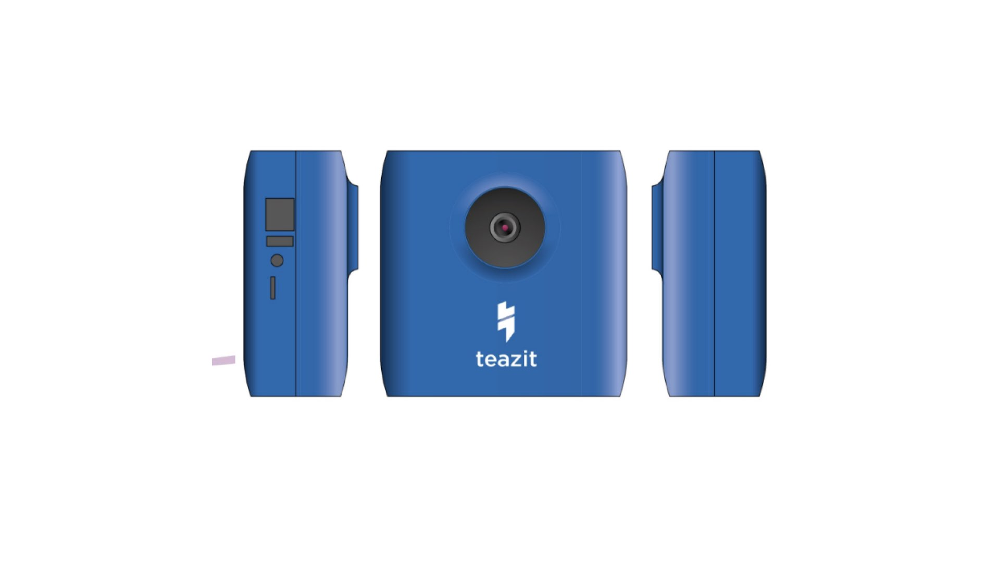

# Cameras

> Teazit 4k cameras

Teazit released it's first 4k connected camera.
Our R&D team focused on building the best camera dedicated to events with
low light conditions. Resulting with the first camera using Sony sensor,
with hight low light sensibility and with a 4k sensor,
dedicated to live-streaming events.

Our goal, at **Teazit**, is to re-work the fixed plan and create the best live
streaming experience to your fans. Our cameras are dedicated to live-streaming
and work directly and closely with our [live-streaming](/live-streamings)
service.

## Summary

- [Summary](#summary)
- [Functionalities](#functionalities)
- [Specifications](#specifications)

## Functionalities

| Functionality     | Description              | State                |
|--------------|:---------------------|:-----------------------:|
| Plug and Play | When power and Ethernet is plugged to the camera, our software automatically authenticate, configure and start a stream when needed. | Y |
| Remote access | Dedicated backoffice accessible from www.teazit.fr | Y |
| 4k sensor     | The term "4K" is generic and refers to any resolution with a horizontal pixel count of approximately 4,000. | Y |
| Region of Interest - *ROI* | Creating multiple region of interests. The camera will be able to switch automatically from one ROI to another. Adding dynamism to your live-streaming with only one camera | Dec 2018 |
| Tracking | Creating a ROI with someone you want to track, and let the camera follow this person | Dec 2018 |
| Multi cameras | Plug additional **Teazit** camera together to create mutliple point of views. | Dec 2018 |

## Specifications

### Software

Creating our own camera allow **Teazit** to fully manage the software running
on it. This software is dedicated to live-streaming and recording the best
quality possible regarding your internet network.

The camera is fully manageable through our live-streaming service. You can start
and record a live-stream anywhere in the world. As long as the camera has
access to the internet.

### Video

|  |  |
|:--------------|:---------------------|
| Sensor     | Sony 4k Sensor              |
| Processor & Encoder (SoM) | Nvidia TX1   |
| Sensor Resolution    | 12.4 Megapixels  |
| Capture Resolution | 4K - 3840 x 2160 pixels |
| Aspect Ratio | 16:9 |
| Frame Rate | 30fps |
| Video - Ethernet Streaming | Up to 1080p30 at 6Mbps max |
| Video - LTE Streaming      | Up to 1080p30 at 4Mbps max - *Work in progress* |
| Video - MP4 Recording only | 4k recording* - *Work in progress* |

!!! note "Social requirements"
    * Facebook maximum streaming resolution is 720p30
    * Instagram maximum streaming resolution is ... ????
    * Twitter / Periscope maximum streaming resolution and bitrate is 540p up to 800Kbps

\*4K recording requires SD card to be UHS Speed Class 3 (U3) or higher.

### Microphone

### Networking

* Ethernet 100Mbps
* Wi-Fi - *Work In Progress*
* LTE - Mobile network - *Work In Progress*

!!! Note "Streaming bandwidth requirements"
    Check your connection using [speedtest.net](https://www.speedtest.net) before purchasing Teazit Camera for live streaming.

    - Full HD: Up to 4 Mbps (At least 3 Mbps of steady upload speed recommended)
    - HD: Up to 3.5 Mbps (At least 2 Mbps of steady upload speed recommended)
    - SD (Standard Definition): Up to 1.5 Mbps (at least 800 kbps of steady upload speed recommended).

### Power & Battery

Included AC Power Adapter

Input: 100-240 VAC, 0.5A

Output: 5VDC 2.0A

### Dimensions & Weight

*Work in Progress*
