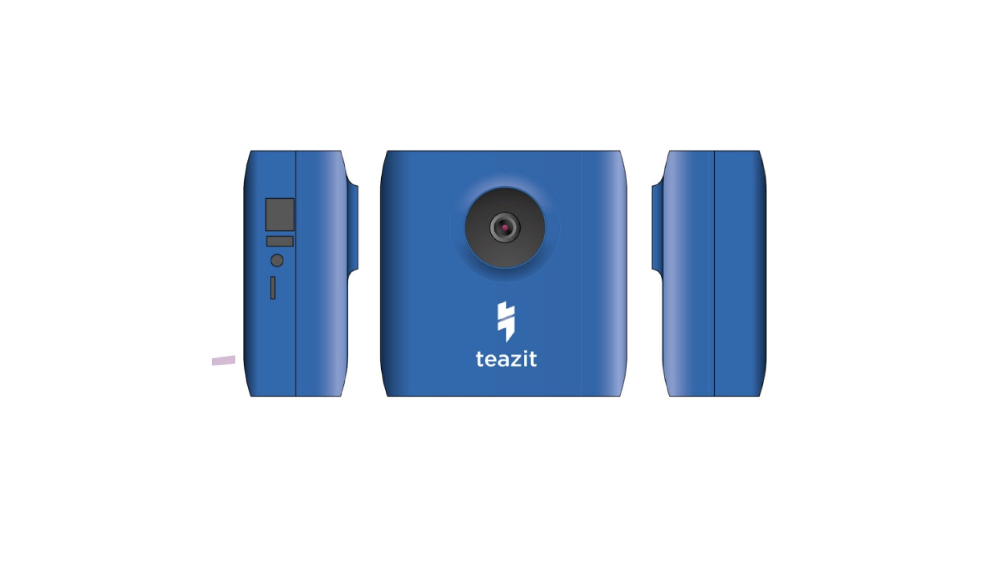

title: Teazit Camera
description: Default Description text
hero: Teazit Camera

# Teazit Cameras
<!-- > Tous les evenements meritent d'un peu plus de visibilité, si seulement... -->

!!! Success "Teazit 4k Camera"
    Teazit released it's first 4k connected camera.
    Our R&D team focused on building the best camera dedicated to events with
    low light conditions. Resulting with the first camera using Sony sensor* dedicated to live-streaming events.

    *\*4k sensor with Low light sensibility*

<!-- > Teazit 4k cameras -->

## Summary

- [Summary](#summary)
- [Motivation](#motivation)
- [Functionalities](#functionalities)
- [Specifications](#specifications)

## Motivation

Our goal, at **Teazit**, is to re-work the fixed plan and create the best live streaming experience to your fans. Our cameras are dedicated to live-streaming and work directly and closely with our [live-streaming](/streamings)
service.

## Functionalities

| Functionality     | Description              | State                |
|--------------|:---------------------|:-----------------------:|
| Plug and Play | When power and Ethernet is plugged to the camera, our software automatically authenticate, configure and start a stream when needed. | Y |
| Remote access | Dedicated backoffice accessible from www.teazit.fr | Y |
| 4k sensor     | The term "4K" is generic and refers to any resolution with a horizontal pixel count of approximately 4,000. | Y |
| Region of Interest - *ROI* | Creating multiple region of interests. The camera will be able to switch automatically from one ROI to another. Adding dynamism to your live-streaming with only one camera | April 2019 |
| Tracking | Creating a ROI with someone you want to track, and let the camera follow this person | April 2019 |
| Multi cameras | Plug additional **Teazit** camera together to create mutliple point of views. | Dec 2019 |

## Specifications

### Software

Creating our own camera allow **Teazit** to fully manage the software running
on it. This software is dedicated to live-streaming and recording the best
quality possible regarding your internet network.

The camera is fully manageable through our live-streaming service. You can start
and record a live-stream anywhere in the world. As long as the camera has
access to the internet.

You can find more information about our software architecture [here](/cameras/software)

### Video

|  |  |  |
|:--------------|:---------------------|-------|
| Sensor     | Sony 4k Sensor              |
| Processor & Encoder (SoM) | Nvidia TX1   |
| Sensor Resolution    | 12.4 Megapixels  |
| Capture Resolution | 4K - 3840 x 2160 pixels |
| Aspect Ratio | 16:9 |
| Frame Rate | 30fps |
| Video - Ethernet Streaming | Up to 1080p30 at 6Mbps max |
| Video - LTE Streaming      | Up to 1080p30 at 4Mbps max | *Work in progress* |
| Video - MP4 Recording only | 4k recording* | *Work in progress* |

*\*4K recording requires SD card to be UHS Speed Class 3 (U3) or higher.*

### Microphone

Teazit work with Rode to capture audio during event.
We design Teazit camera to handle all events configurations. Our microphone is pluggable and we can either capture audio form a simple ambient micro or directly on the sound desk.

- Simple Microphone
- Lapel Microphone
- Ambient Microphone
- Directly from a sound desk

### Networking

|  |  |  |
|--|--|--|
| Ethernet | | |
| Wi-Fi | | *Work In Progress*
| LTE - Mobile network | | *Work In Progress*

!!! Note "Streaming bandwidth requirements"
    Check your connection using [speedtest.net](https://www.speedtest.net) before purchasing Teazit Camera for live streaming.

    |  |  |  |
    |--|--|--|
    | Full HD | 1080p | Up to 4 Mbps *(At least 3 Mbps of steady upload speed recommended)* |
    | HD | 720p | Up to 3.5 Mbps *(At least 2 Mbps of steady upload speed recommended)* |
    | SD | 540p | Up to 1.5 Mbps *(at least 800 kbps of steady upload speed recommended).* |
