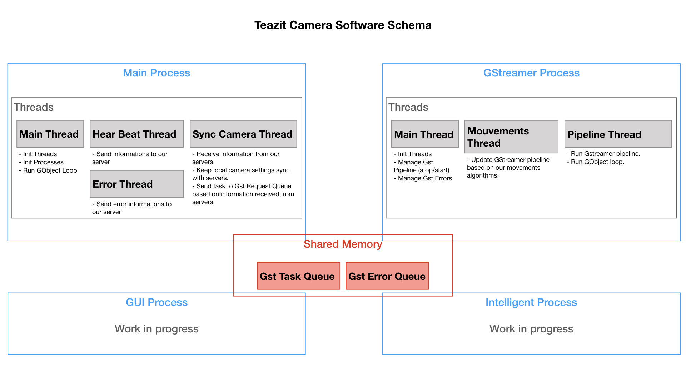

title: Teazit Software Camera
description: Default Description text
hero: Teazit Software Camera

# Teazit Software Cameras

**On this page you will learn:**

- How we architect our processes.
- Our Shared memory.
- The responsibility of each process.

## Open Source

Under the hook, we are using multiple open-source projects that we like to thank.

- [GStreamer](https://gstreamer.freedesktop.org)
- [Qt](https://qt.io)
- [OpenCV](https://opencv.org/)
- [TensorFlow](https://www.tensorflow.org/)

## Multiprocessing

> Our software is currently built to take the full advantages of multiprocessing.

### Main Process
This is our main process, the brain of our camera.

**It has three main goals:**

- Managing all the other processes (start, stop,
  restart, etc...)
- Managing the shared resources, the camera and network settings.
- Keeping the camera synchronize with our remote servers.

### GStreamer Process
This process handle GStreamer pipeline.

**It has two main goals:**

- Managing GStramer pipeline.
- Starting our movements algorithms.

### GUI Process
This process is optional, depending if you want to have a GUI interface to
interact with our software.
This process handle all the GUI events.

**It has two main goals:**

- Displaying useful user informations.
- Managing all GUI events.

### IA Process
We have dedicated an IA Process to make sure we can take the full advantages
of machine learning.

**It has one main goals:**

- Detecting Region of Interest in the images.
