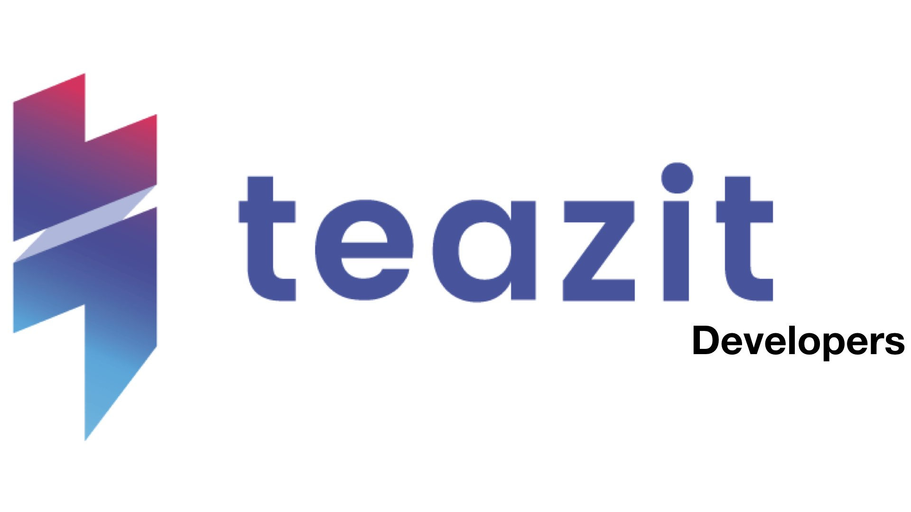

#
> Just telling 'how it works' is not always enough to get your ideas
> across, while neither is just showing them running.

## Our Products

[iOS - Android App](/products/application) |
[Teazit Cameras](/products/cameras) | [Live-streamings](/products/live-streamings)

## Our documentation
[FAQ](/docs/faq) | [Tutorials](/docs/tutorials) | API | SDK

## Motivation

We decided to develop this documentation corner, because **Teazit** own 100% of it's technology. Following, we want to explain and show you what we are currently building, why and how. This corner aims to be the ideal resources to have all the information wanted, either you are a **Teazit User**, a potential **investor**,
or a future employee.

If you find any improvement, fell free to drop us an email [here](mailto:contact@teazit.fr)

The documentation corner gives you further information on concepts used,
technologies, dependencies, complexity computations...
In other words, it's the ideal resources partner for learning how
Teazit works.
