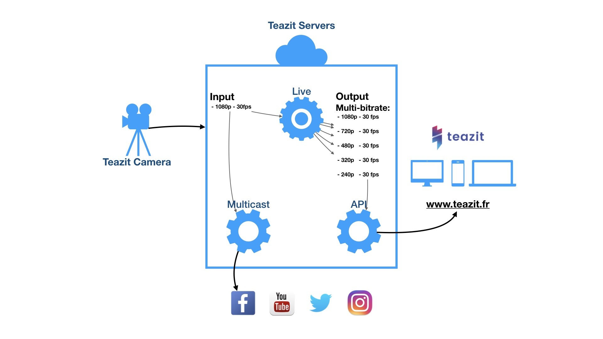

# Live Streamings

Live streaming is becoming more and more present on social media.
Facebook, Youtube, Twitter, Twitch... own their own live-streaming technology.
At Teazit, we also thing that live videos brings authentic moments
and events to life in a way that no words or pictures can. That why, we are very proud to announce:

!!! success "Check"
    **We fully own and control our live streaming technology.**

The decision to build our own streaming technology had a high impact on our
development team. However, we didn't want to depend on a third party company,
like Wowza, because we knew that this technology was **only** the first step
of our vision.

Following, you will find all the informations to understand our live-streamings
technology, security, how we interact with other media and of our next steps.

## Summary

- [Summary](#summary)
- [Streamings](#streamings)
- [Security](#security)
- [Socials - Broadcast](#socials-broadcast)

> First Teazit live during a Js Meetup

## Streamings

At **Teazit**, we rely on RTMP (Real-Time Messaging Protocol). It allow a very
low-latency communication between our camera and our servers. Then we rely on
multi-bitrates HLS (Http Live Streaming) to provide our user with the best
streaming quality regarding their network limitations. Let's see how it looks:

> Teazit live technology schema

## Security

We are very focus to provide the best security around Teazit streaming. Developing
our own technology allow us to keep the full control of our data and make sure
we keep your privacy... private. Nowadays, Teazit don't sell any information and
we are not planning to do it. If we do, **we promise**, we will inform you.

You can find more information about our actions regarding security
[here](/security).

## Socials - Broadcast

Because we know you love and use all socials media, Teazit Live technology aims
to give you the power to broadcast your stream to everyones.

Social media we can interact with:

* Facebook

Social media we are actively working on:

* Twitter | Youtube | Twitch

## Technical States

Our **Stream**, at Teazit, rely on Finite-State Machine pattern to keep every
streams secure and working. You can read an understand more about the different states bellow:

- **Draft**:
- **Scheduled**:
- **Starting**:
- **Preview**:
- **Live**:
- **Interrupted**:
- **Stoping**:
- **Stopped**:
- **Archived**:

## Technical Specs
### General
- 4 hour maximum length for live stream and preview.
- For security reason, RTMP ([wiki]("https://en.wikipedia.org/wiki/Real-Time_Messaging_Protocol")) stream URLs will expire 12 hours after they are created.

### Video format
- We accept video in maximym 1080p (1920x1080) resolution at 30 frames per second,
with 1 key frame every 2 seconds.

- Our recommended max bit rate is 4 Mbps. Going above this maximum is possible but
the live stream might become unstable.

#### Advance

- Pixel Sample Ratio: Square
- Video Codec: h264

### Audio format

- Audio Sample Rate: 48 KHz
- Audio Bitrate: 128 Kbps mono. However we can do stereo.

#### Advance:
- Audio Codec: AAC
